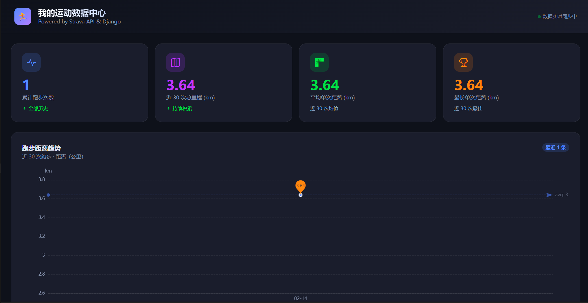

## 项目概述 (Project Overview)

本项目是一个基于 **Django + Strava API + ECharts** 的个人跑步数据看板，用于**自动聚合第三方运动平台（Strava）的跑步数据，并以现代数据大屏的形式进行可视化分析和历史复盘**。



- **核心技术栈**
  - **后端框架**：Django（ORM、管理命令、模板系统）
  - **第三方 API**：Strava REST API（OAuth 2.0 授权、运动数据获取）
  - **前端可视化**：Apache ECharts 5（折线图、柱状图、渐变面积）
  - **UI 框架**：Bootstrap 5 + Bootstrap Icons（响应式布局与图标）
  - **认证协议**：OAuth 2.0 授权码模式（Authorization Code Grant）
  - **存储层**：SQLite（开发环境默认数据库）
  - **环境管理**：`python-dotenv`（加载 `.env` 中的 Client ID / Secret 与 Token）


## 核心业务流转：OAuth 2.0 与数据同步 (Data Synchronization Flow)

本项目的数据来源于 Strava，需要用户授权后才能访问其私有运动记录。整体流程遵循 **OAuth 2.0 授权码模式**，核心逻辑封装在 Django Management Command `sync_strava` 中（`runs/management/commands/sync_strava.py`）。

### **2.1 使用 Client ID / Secret 引导用户完成授权**

- 在 Strava 开发者后台获取的 `client_id` 与 `client_secret` 被保存在项目根目录的 `.env` 文件中，通过 `os.getenv("STRAVA_CLIENT_ID")` 和 `os.getenv("STRAVA_CLIENT_SECRET")` 读取。
- 命令启动后，如果没有可用的 `access_token`，会通过 `_build_auth_url(client_id)` 构造标准的 OAuth 授权链接：

```python
params = {
    "client_id": client_id,
    "redirect_uri": REDIRECT_URI,          # 一般为 http://localhost
    "response_type": "code",               # 授权码模式
    "scope": "activity:read_all",          # 读取全部活动（含隐私）
    "approval_prompt": "auto",
}
auth_url = f"{BASE_URL}/oauth/authorize?{urlencode(params)}"
```

- 用户在终端中看到该 URL，复制到浏览器打开后登录并同意授权，Strava 会将用户重定向到预配置的 `redirect_uri`，并在 URL 查询参数中附带 `code=xxxx` 授权码。

### **2.2 授权码换取 Access Token**

- 用户将重定向后的完整 URL 粘贴回终端，命令通过 `_extract_code(redirected_url)` 使用 `urlparse + parse_qs` 在本地解析出 `code`：

```python
parsed = urlparse(redirected_url)
code_list = parse_qs(parsed.query).get("code")
```

- 获取到授权码后，命令调用 `_exchange_token(client_id, client_secret, code)`，向 Strava 的 Token 端点发起 **POST 请求**：

```python
resp = requests.post(
    f"{BASE_URL}/oauth/token",
    data={
        "client_id": client_id,
        "client_secret": client_secret,
        "code": code,
        "grant_type": "authorization_code",
    },
    timeout=15,
)
resp.raise_for_status()
token_data = resp.json()
access_token = token_data["access_token"]
refresh_token = token_data.get("refresh_token", "")
```

- 该过程即完成了 OAuth 2.0 流程中的「**授权码换令牌（code → access_token）**」步骤。脚本会友好地提示用户将 `STRAVA_ACCESS_TOKEN` / `STRAVA_REFRESH_TOKEN` 写入 `.env`，方便后续同步时跳过授权交互。

### **2.3 使用 Access Token 拉取运动 JSON 数据**

- 拿到 `access_token` 后，命令会调用 `_fetch_runs(access_token, count)` 访问 Strava 活动接口 `/api/v3/athlete/activities`：

```python
resp = requests.get(
    f"{BASE_URL}/api/v3/athlete/activities",
    headers={"Authorization": f"Bearer {access_token}"},
    params={"per_page": max(count * 3, 30), "page": 1},
    timeout=15,
)
all_activities = resp.json()
runs = [a for a in all_activities if a.get("type") == "Run"]
runs = runs[:count]
```

- 这里通过：
  - `Authorization: Bearer <access_token>` 实现基于令牌的 API 访问控制；
  - `per_page` 多取一些活动，然后在本地按 `type == "Run"` 过滤出跑步记录，保证即使用户有骑行、游泳等多类运动，依然能拿到足够多的跑步条目。

### **2.4 使用 `update_or_create` 实现幂等落库**

- 拉取到 JSON 数据后，命令调用 `_save_runs(runs, stdout)` 将每条活动映射为 `RunActivity` 实例，并使用 `update_or_create` 实现**幂等写入**：

```python
for run in runs:
    strava_id = str(run["id"])
    date = parse_datetime(run.get("start_date_local", "")) or parse_datetime(
        run.get("start_date", "")
    )

    defaults = {
        "name": run.get("name", "未命名"),
        "date": date,
        "distance_km": round(run.get("distance", 0) / 1000, 3),
        "moving_time_min": round(run.get("moving_time", 0) / 60, 2),
        "average_heart_rate": run.get("average_heartrate"),
    }

    _, created = RunActivity.objects.update_or_create(
        strava_id=strava_id,
        defaults=defaults,
    )
```

- 关键点：
  - 将 Strava 活动的 `id` 转为字符串 `strava_id`，作为业务上的唯一标识；
  - 若数据库中不存在该 `strava_id`，则插入新纪录（`created=True`）；
  - 若已存在，则更新对应行的数据（`created=False`）。
- 这样，即使用户多次执行 `python manage.py sync_strava`，同一条 Strava 活动只会被更新而不会重复插入，保证数据同步流程**幂等（idempotent）**，避免重复统计与脏数据。


## 数据库结构设计 (Database Schema)

核心业务数据存储在 `RunActivity` 模型中（`runs/models.py`），用于表示一条从 Strava 同步过来的跑步记录。

### **3.1 RunActivity 模型字段设计**

| 字段名 | 类型 | 约束 / 选项 | 业务含义 |
|--------|------|-------------|----------|
| `strava_id` | `CharField(64)` | `unique=True` | Strava 活动的唯一 ID，映射自 Strava JSON 中的 `id` 字段，是本地去重与幂等写入的关键业务主键。 |
| `name` | `CharField(255)` | 必填 | 活动名称，例如「清晨公园慢跑」。 |
| `date` | `DateTimeField` | 必填 | 运动开始时间，对应 `start_date_local` / `start_date`。 |
| `distance_km` | `FloatField` | 必填 | 运动距离（公里），由原始数据中的米数 `distance` 转换为 `km`。 |
| `moving_time_min` | `FloatField` | 必填 | 移动时间（分钟），由原始数据中的秒数 `moving_time` 转换为分钟。 |
| `average_heart_rate` | `FloatField` | `null=True, blank=True` | 平均心率（bpm），如果用户未佩戴心率设备则为空。 |
| `synced_at` | `DateTimeField` | `auto_now=True` | 最后一次同步到本地数据库的时间戳，用于排查同步延迟、版本更新等问题。 |

- `Meta` 配置：
  - `ordering = ["-date"]`：默认按日期倒序排列，方便后台查询最近一次活动。

### **3.2 为什么使用 `strava_id` 作为唯一键**

- Strava 的活动 ID 在单个用户维度下是全局唯一且稳定的，非常适合作为**业务主键（Business Key）**。
- 将 `strava_id` 设为唯一索引（`unique=True`）有几大好处：
  - 从数据库层面保证不会出现两条记录映射到同一个 Strava 活动；
  - 与 `update_or_create(strava_id=...)` 配合，可以天然获得**幂等同步**能力；
  - 简化业务逻辑，不需要额外的去重表或同步日志。


## 前端可视化逻辑 (Data Visualization)

前端可视化由 Django 的 View、Template 与 ECharts 协作完成，形成一条从数据库 QuerySet 到浏览器图表的完整数据流。

### **4.1 View 层：从 QuerySet 到 ECharts 所需数组**

在 `runs/views.py` 中，`dashboard_view` 是看板首页的核心视图函数：

1. **查询最近 30 条跑步记录，并按日期升序排列**：

```python
recent_runs = RunActivity.objects.order_by("-date")[:30]
recent_runs = list(reversed(recent_runs))  # 转为升序，让折线图从旧到新
```

2. **拆解重组为前端图表友好的数组结构**：

```python
dates = [run.date.strftime("%m-%d") for run in recent_runs]
distances = [round(run.distance_km, 2) for run in recent_runs]
durations = [round(run.moving_time_min, 1) for run in recent_runs]
heart_rates = [run.average_heart_rate or 0 for run in recent_runs]
```

3. **汇总统计数据用于概览卡片**：

```python
total_runs = RunActivity.objects.count()
total_km = sum(distances) if distances else 0
avg_distance = round(total_km / len(distances), 2) if distances else 0
best_distance = max(distances) if distances else 0
```

4. **通过 `json.dumps` 将 Python 列表安全序列化为 JSON 字符串**，传递到模板层供 JS 直接使用：

```python
context = {
    "runs": recent_runs,
    "total_runs": total_runs,
    "total_km": round(total_km, 2),
    "avg_distance": avg_distance,
    "best_distance": best_distance,
    "dates_json": json.dumps(dates, ensure_ascii=False),
    "distances_json": json.dumps(distances),
    "durations_json": json.dumps(durations),
    "heart_rates_json": json.dumps(heart_rates),
}
```

这样，View 层既承担了数据聚合和简单统计的职责，又为前端图表准备好了结构化、扁平化的数据源。

### **4.2 Template 层：将后端 JSON 绑定到 DOM 并渲染 ECharts**

在 `runs/templates/runs/dashboard.html` 中，模板完成了以下几件事：

1. **引入前端依赖**
   - 使用 CDN 引入 `Bootstrap 5` 与 `Bootstrap Icons`，快速构建响应式布局与统一的视觉风格；
   - 使用 CDN 引入 `ECharts 5`，作为图表引擎。

2. **高颜值 Dashboard 布局**
   - 顶部：渐变背景导航条 + 项目标题「我的运动数据中心」+ 同步状态小组件；
   - 上方一行：4 张统计卡片，展示：
     - 累计跑步次数
     - 近 30 次总里程
     - 平均单次距离
     - 最长单次距离
   - 中间：占据主要视窗的「跑步距离趋势」平滑折线图，附带渐变面积阴影和均值基准线；
   - 下方两列：平均心率柱状图 + 跑步时长渐变柱状图；
   - 最底部：近 30 次跑步详细记录表格，包含名称、日期、距离、时长、心率区间标签等。

3. **通过 JS 将后端 JSON 绑定到 ECharts 实例**

```html
<script>
  const DATES       = {{ dates_json|safe }};
  const DISTANCES   = {{ distances_json|safe }};
  const DURATIONS   = {{ durations_json|safe }};
  const HEART_RATES = {{ heart_rates_json|safe }};
</script>
```

之后，在同一个脚本块中初始化多个 ECharts 实例，例如主图「距离趋势折线图」：

```js
const chart = echarts.init(document.getElementById('distanceChart'));
chart.setOption({
  backgroundColor: 'transparent',
  grid: baseGrid(30),
  tooltip: baseTooltip(params => {
    const p = params[0];
    return `<div style="font-weight:600;margin-bottom:4px">${p.name}</div>`
         + `<span style="color:${COLOR_BLUE}">● 距离：${p.value} km</span>`;
  }),
  xAxis: baseXAxis(),              // 使用 DATES 作为类目轴
  yAxis: { ...baseYAxis('km') },
  series: [{
    name: '距离',
    type: 'line',
    data: DISTANCES,               // 距离数组作为 Y 轴
    smooth: true,
    areaStyle: { /* 渐变填充 */ },
    markPoint: { type: 'max', ... },
    markLine: { type: 'average', ... },
  }],
});
```

- `baseXAxis()` 将 `DATES` 作为类目轴数据，并统一设置坐标轴样式；
- `DISTANCES` 作为折线图的数据源，借助 ECharts 的 `smooth`、`areaStyle` 和渐变色配置绘制出带面积阴影的平滑曲线；
- 类似地，心率与时长图表分别用 `HEART_RATES` 与 `DURATIONS` 作为柱状图的数据源，并根据心率区间动态上色，增强可读性。


## 运行与部署指南 (How to Run)

下面是一套**极简的本地运行步骤**，适合开发与本地 Demo 环境。

### **5.1 环境准备**

- 安装 Python（建议 3.10+）
- 克隆本项目代码到本地工作目录

### **5.2 安装依赖**

在项目根目录（包含 `manage.py` 的目录）执行：

```bash
pip install -r requirements.txt
```

`requirements.txt` 中包括：

- `django`：Web 框架
- `requests`：调用 Strava HTTP API
- `python-dotenv`：加载 `.env` 中的环境变量

### **5.3 配置 `.env` 文件**

在项目根目录创建 `.env`（可参考 `.env.example`）：

```env
STRAVA_CLIENT_ID=你的_client_id
STRAVA_CLIENT_SECRET=你的_client_secret

STRAVA_ACCESS_TOKEN=你的_access_token
STRAVA_REFRESH_TOKEN=你的_refresh_token
```

确保在 Strava 开发者后台将回调域配置为 `localhost`。

### **5.4 数据库迁移**

初始化 SQLite 数据库结构：

```bash
python manage.py migrate
```

若后续调整了 `RunActivity` 模型：

```bash
python manage.py makemigrations runs
python manage.py migrate
```

### **5.5 同步 Strava 跑步数据**

**首次同步（需要 OAuth 授权交互）：**

```bash
python manage.py sync_strava
```

流程：

- 终端打印一条 Strava 授权链接；
- 在浏览器中打开，登录 Strava 并点击「Authorize」；
- 复制浏览器地址栏中以 `http://localhost/...` 开头的完整 URL 粘贴回终端；
- 命令自动使用授权码换取 `access_token`，并将最近 N 条跑步活动写入本地数据库。

**后续同步（已有 Token，可跳过授权）：**

将从上一步获得的 Token 写入 `.env`：

```env
STRAVA_ACCESS_TOKEN=...
STRAVA_REFRESH_TOKEN=...
```

然后直接执行：

```bash
python manage.py sync_strava --count 30
```

命令会幂等地更新数据库记录（基于 `strava_id`）。

### **5.6 启动 Web 服务并访问看板**

在项目根目录执行：

```bash
python manage.py runserver 8000
```

浏览器访问 `http://127.0.0.1:8000/` 即可看到完整的跑步数据看板。

